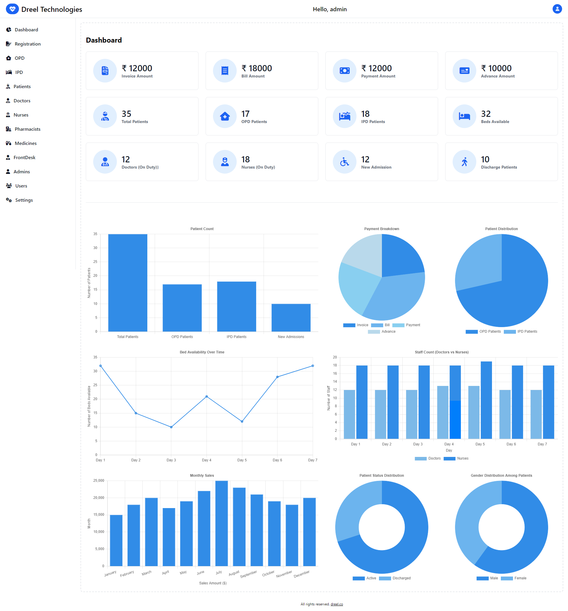

# Healthcare ERP Software

## [Visit Website Here..](https://healthcare-erp.dreel.co/)

## Project Overview

Welcome to the **Healthcare ERP Software**, an integrated solution designed to streamline operations and enhance the efficiency of healthcare institutions. This software caters to various account types and provides comprehensive management of outpatient (OPD) and inpatient (IPD) registrations, updates, and deletions, along with robust stats and attendance management.

## Features

### Account Types

The software supports six distinct account types:

- **Admin**
- **Doctor**
- **Nurse**
- **Pharmacist**
- **Patient**
- **Frontdesk**

### General Functionalities

- **User Management**

  - Create, update, delete, and manage user accounts for all account types.
- **OPD/IPD Management**
  - Register, update, and delete patient records for both outpatient and inpatient departments.
- **Appointment Scheduling**
  - Schedule, reschedule, and cancel appointments for patients.
- **Medical Records Management**
  - Maintain and access patient medical histories, treatment plans, and prescriptions.
- **Billing and Invoicing**
  - Generate, manage, and track invoices and billing information.
- **Inventory Management**
  - Manage medical supplies and inventory levels.
- **Notifications and Alerts**
  - Send automated notifications and alerts to staff and patients.
- **Reporting and Analytics**
  - Generate detailed reports and analytics on hospital performance, patient statistics, and staff attendance.
- **Stats Management**
  - Track and manage vital statistics related to patient care, treatment outcomes, and hospital performance.
- **Attendance Management**
  - Monitor and manage attendance records for hospital staff including doctors, nurses, and administrative personnel.

## Previews



## Technology Stack

### Frontend

- **React:** A JavaScript library for building user interfaces.
- **Tailwind CSS:** A utility-first CSS framework for rapid UI development.
- **Flowbite:** A library of web components built with Tailwind CSS.
- **React-Loader:** A library for loading indicators in React applications.
- **Axios:** A promise-based HTTP client for making API requests.

### Backend

- **Node.js:** A JavaScript runtime for server-side programming.
- **Express:** A web application framework for Node.js.
- **MongoDB:** A NoSQL database for storing application data.

### Deployment

- **AWS EC2:** The software is deployed on Amazon Web Services EC2 instances.
- **PM2:** A production process manager for Node.js applications.
- **Nginx:** A reverse proxy server for handling HTTP requests.

## Installation

### Prerequisites

- Node.js
- npm (Node Package Manager)
- MongoDB
- AWS account with EC2 instance

### Backend Setup

1. Clone the repository.
2. Navigate to the backend directory.
3. Install the required packages:

    ```bash
    npm install
    ```

4. Start the backend server using PM2:

    ```bash
    pm2 start server.js
    ```

### Frontend Setup

1. Navigate to the frontend directory.
2. Install the required packages:

    ```bash
    npm install
    ```

3. Start the frontend development server:

    ```bash
    npm start
    ```

### Deployment

1. Set up an EC2 instance on AWS.
2. Configure Nginx as a reverse proxy to forward requests to the Node.js application.
3. Deploy the backend and frontend applications on the EC2 instance.
4. Ensure PM2 is set to restart the application on server reboot:

    ```bash
    pm2 startup
    pm2 save
    ```

## Usage

1. Navigate to the deployed application URL.
2. Log in with your account credentials.
3. Use the dashboard to manage patient registrations, view stats, handle attendance records, and utilize other functionalities.

## Contributors

- [ Abhishek Kumar Singh ]

## License

This project is licensed under the MIT License.

---

For more information, visit our [Website](https://healthcare-erp.dreel.co) or contact us at [E-mail](mailto:singh.abhishek151019@gmail.com).
